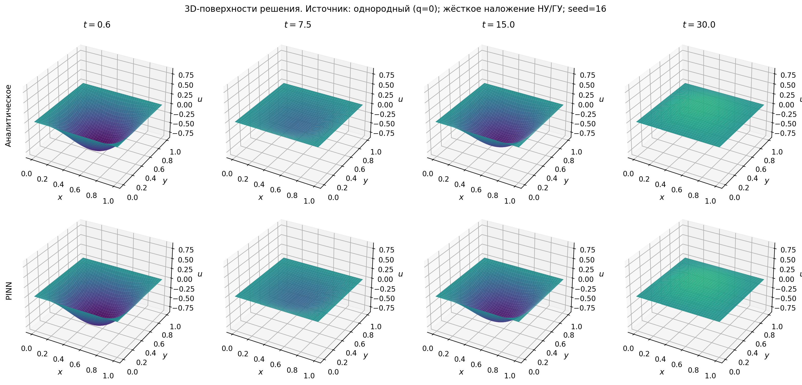
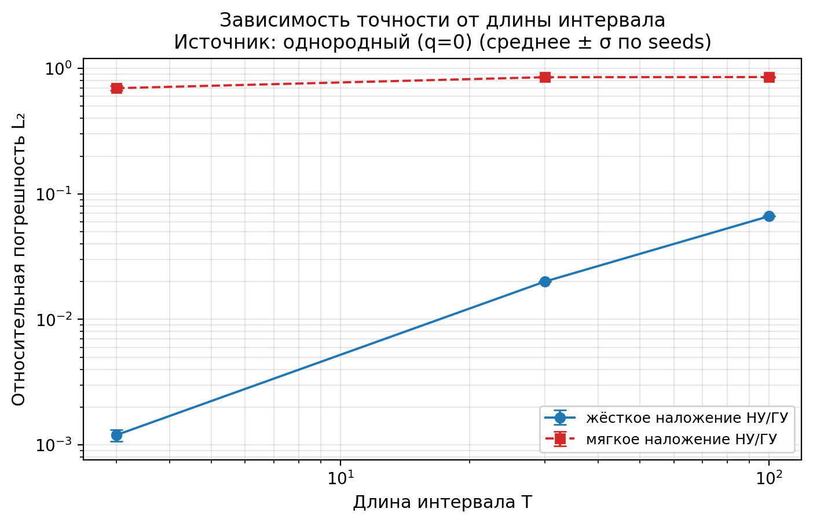
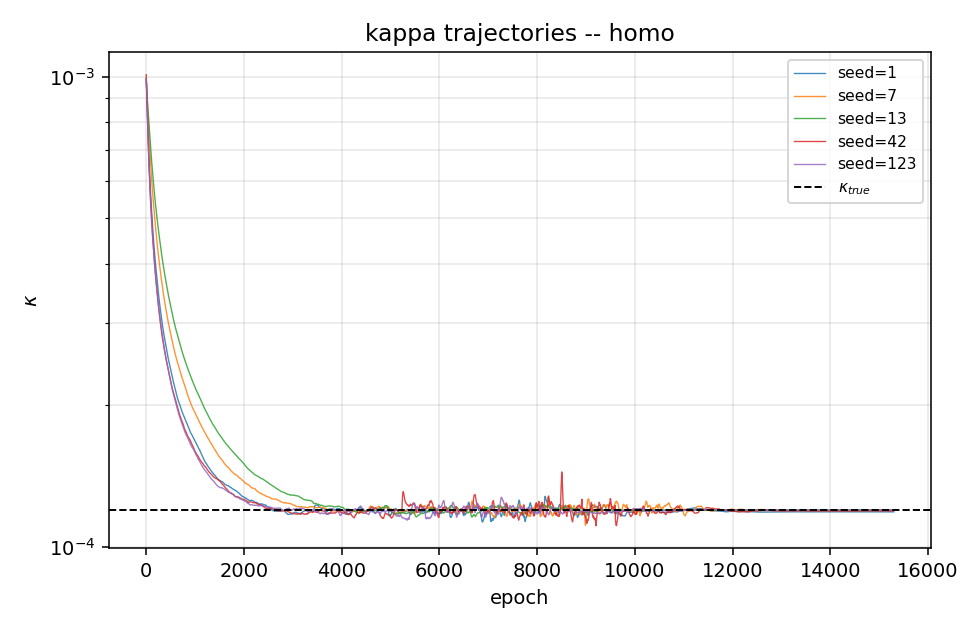
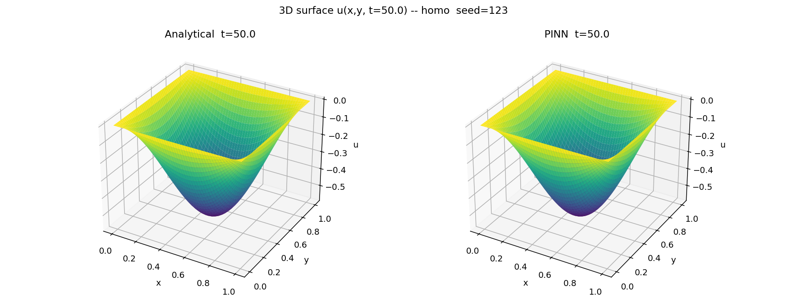

# PINN для гиперболической теплопроводности (Грин–Нагди III)


Решение и идентификация параметров двумерного **гиперболического уравнения
теплопроводности** (модель Грина–Нагди III рода) с помощью
**Physics-Informed Neural Networks (PINN)** на PyTorch.

В отличие от классического параболического уравнения, здесь тепло распространяется
с конечной скоростью (волновой член ∂²θ/∂t²), что делает задачу заметно жёстче
как для нейросетевого, так и для классического численного решения.

## ✨ Ключевые результаты

| Задача | Что делает | Результат |
|---|---|---|
| **Прямая** | численное решение PDE при известном κ | относительная **L2-ошибка ≈ 0,1 %** против аналитики |
| **Обратная** | идентификация κ по зашумлённым датчикам | κ восстановлен как **(1,19 ± 0,005)·10⁻⁴** при истинном **1,2·10⁻⁴** (ошибка ≈ 0,5 %) |

Дополнительно: подбор архитектуры (Optuna GridSampler, 16 конфигураций),
подбор скорости обучения (TPE), исследование устойчивости к уровню шума и к
начальному приближению κ (ablation studies), сравнение жёсткого и мягкого
наложения граничных/начальных условий.

## 🔬 Уравнение

Безразмерная форма на области Ω = (0,1)²:

```
∂²θ/∂t² − κ(∂³θ/∂x²∂t + ∂³θ/∂y²∂t) − (∂²θ/∂x² + ∂²θ/∂y²) = ∂q/∂t
```

Граничные условия θ|∂Ω = 0, начальные θ(x,y,0) = sin(πx)·sin(πy), θ_t(x,y,0) = 0.
Два источника тепла: q = 0 (однородный) и q = 2xt (неоднородный).

## 📊 Результаты в картинках

**Прямая задача** — поле решения PINN и зависимость точности от горизонта времени T:

| Поле решения θ(x,y,t) | Точность vs горизонт T |
|---|---|
|  |  |

**Обратная задача** — сходимость оценки κ к истинному значению и восстановленное поле:

| Идентификация κ | Восстановленное поле |
|---|---|
|  |  |

## 🧠 Метод

- **Архитектура**: полносвязная сеть с residual-блоками; время кодируется набором
  тригонометрических признаков sin/cos(kω₀t).
- **Наложение условий** (прямая задача): *жёсткое* (анзац, точно удовлетворяющий
  ГУ/НУ по построению) либо *мягкое* (взвешенные штрафы в функции потерь с
  обучаемыми весами).
- **Невязка PDE** вычисляется через автоматическое дифференцирование
  (`torch.autograd.grad`, до производных 3-го порядка).
- **Обучение**: NAdam → дообучение L-BFGS, ранняя остановка по плато.
- **Идентификация** (обратная задача): κ — обучаемый параметр (`log κ`),
  оптимизируется совместно с весами сети по данным датчиков с шумом.
- **Верификация**: аналитическое модальное разложение по sin(nπx)sin(mπy) с
  интегрированием ОДУ (scipy DOP853) и независимый численный метод прямых (BDF).

## 🗂️ Структура

```
inverse/                 # обратная задача: идентификация κ
  pinn_diploma.py        #   PINN + совместная оценка κ по датчикам
  pinn_homogeneous_*.py  #   итерации модели
  resnet.py, ...         #   вспомогательные модули
forward/                 # прямая задача: численное решение
  pinn_forward.py        #   PINN-солвер (жёсткое/мягкое наложение условий)
  numerical_solver.py    #   эталон: метод прямых (BDF)
  regenerate_*_plots.py  #   перерисовка графиков из metrics.json
results/
  forward/               # метрики (metrics.json) и графики прямой задачи
  inverse/               # метрики и графики обратной задачи
```

## 🚀 Запуск

```bash
pip install torch numpy scipy matplotlib pandas optuna

# Прямая задача (численное решение)
python forward/pinn_forward.py

# Обратная задача (идентификация κ)
python inverse/pinn_diploma.py
```

GPU (CUDA) подхватывается автоматически при наличии.

## 🛠️ Стек

Python · PyTorch (autograd, L-BFGS) · NumPy / SciPy (DOP853, BDF) · Optuna (HPO) ·
Matplotlib · pandas

---

> Репозиторий содержит только исследовательский код и численные результаты.
